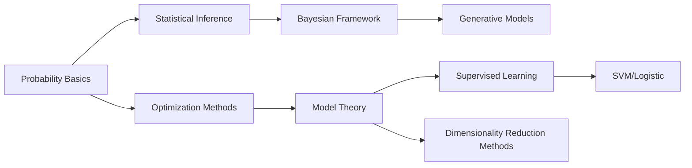

[Blog](https://xinheliu.github.io/MachineLearning/) on Machine Learning basics

### Posts

- Data Science
  - Data Analysis

- Math
  - Math Fundamentals
  - Linear Algebra
  - Statistics
  - Introduction to Linear Algebra

- Classic
  - Supervised Learning
  - Unsupervised Learning
  - Machine Learning Pipeline
  - Understanding Linear Regression

- Bayesian
  - Bayesian Methods

- Deep Learning
  - Deep Learning
  - Neural Networks Fundamentals

### Learning Path

